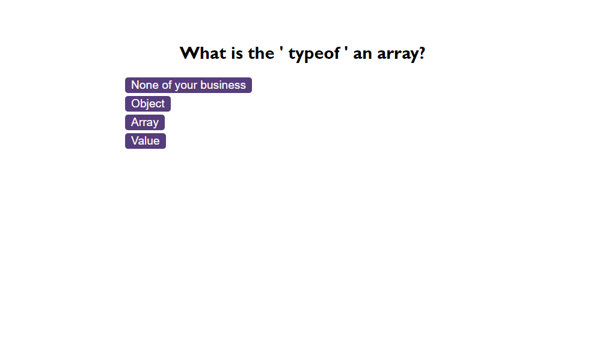

# Code-Quiz
Interactive, timed quiz testing JavaScript knowledge.

## Deployed Application
[Code Quiz](https://benedictcodeshere.github.io/Code-Quiz/)

## Description
This is a timed quiz designed to test the user's JavaScript knowledge. The user is given a question and four answers to choose from per question. The user will be penalised for incorrect answers with a time deduction. They get a point per correct answer. Once the time runs out or the quiz runs out of questions, the user will be presented with their final score. They can then save their highscore and initials to a leaderboard, populated via local storage.

## Installation

N/A

## Usage

The way to use the deployed application is to:
1. Click the start button to begin the quiz,
2. Read the question and select an answer by clicking one of the four answer buttons,
3. Once the quiz is over, then the user can input their initials to save their score to a leaderboard.
They do this by typing their initials into the input box.
4. They can view the leaderboard of high scores
## Screenshot Of Deployed Application

## Credits

N/A

## License

Please refer to the license in the repo (MIT License).

